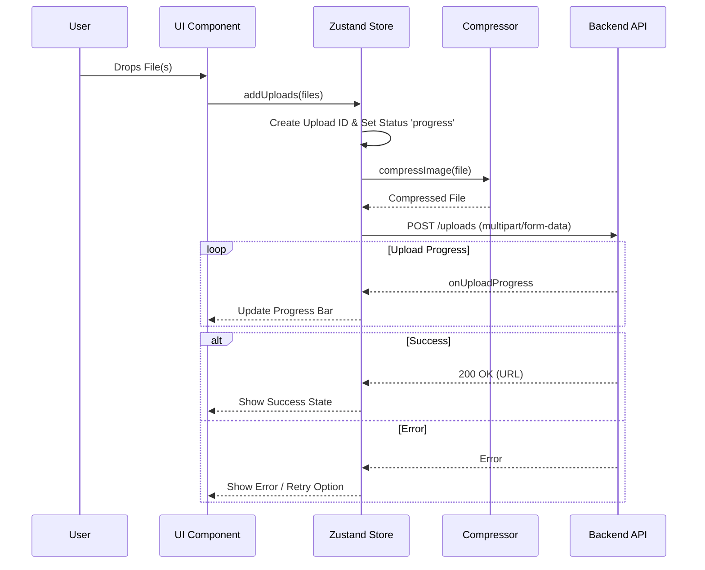

# 📤 React Upload Widget


> **A high-performance, minimizable, and feature-rich file upload widget built with React 19, Tailwind CSS 4, and Zustand.**

---

## 📖 About The Project

This project is a modern, production-ready **Upload Widget** designed to handle file uploads with a polished user experience. It solves the common problem of managing complex file upload states (progress, error, cancellation) in web applications while maintaining a clean and unobtrusive UI.

The widget supports drag-and-drop, real-time progress tracking, and automatic image compression, all wrapped in a collapsible interface that stays out of the user's way.

### ✨ Key Features

*   **🚀 Drag & Drop Interface**: Seamless file selection using `react-dropzone`.
*   **📉 Automatic Image Compression**: Client-side image compression to save bandwidth and storage using HTML Canvas.
*   **📊 Real-time Progress**: Visual feedback for upload progress, total size, and compressed size.
*   **🔄 Robust State Management**: Powered by **Zustand** and **Immer** for handling complex asynchronous flows.
*   **🎨 Smooth Animations**: Fluid transitions for collapsing/expanding and list updates using **Motion**.
*   **⏯️ Control**: Ability to **cancel** and **retry** individual uploads.
*   **🧩 Minimizable UI**: A collapsible "floating" widget that expands only when needed.

### 🏗️ Architecture



---

## 🛠️ Tech Stack

### **Core**
*   **Framework**: [React 19](https://react.dev/)
*   **Language**: [TypeScript](https://www.typescriptlang.org/)
*   **Build Tool**: [Vite](https://vitejs.dev/)

### **Styling & UI**
*   **CSS Framework**: [Tailwind CSS v4](https://tailwindcss.com/)
*   **Components**: [Radix UI](https://www.radix-ui.com/) (Collapsible, Progress, Scroll Area)
*   **Icons**: [Lucide React](https://lucide.dev/)
*   **Animations**: [Motion](https://motion.dev/)
*   **Utilities**: `tailwind-merge`, `tailwind-variants`

### **State & Data**
*   **State Management**: [Zustand](https://zustand-demo.pmnd.rs/) + [Immer](https://immerjs.github.io/immer/)
*   **HTTP Client**: [Axios](https://axios-http.com/)
*   **File Handling**: [React Dropzone](https://react-dropzone.js.org/)

---

## 🚀 Getting Started

Follow these steps to get a local copy running.

### Prerequisites

*   **Node.js** (v18+ recommended)
*   **npm**, **yarn**, or **pnpm**
*   **Backend Server**: The widget expects a backend running at `http://localhost:3333/uploads` to handle the `POST` requests.

### Installation

1.  **Clone the repository**
    ```bash
    git clone https://github.com/yourusername/upload-widget.git
    cd upload-widget/web
    ```

2.  **Install dependencies**
    ```bash
    npm install
    # or
    pnpm install
    # or
    yarn install
    ```

3.  **Start the development server**
    ```bash
    npm run dev
    ```

4.  **Open in browser**
    Navigate to `http://localhost:5173` to see the widget in action.

---

## 💻 Usage

### Development Commands

| Command | Description |
| :--- | :--- |
| `npm run dev` | Starts the local development server with Vite. |
| `npm run build` | Builds the project for production (TypeScript compile + Vite build). |
| `npm run lint` | Runs ESLint to check for code quality issues. |
| `npm run preview` | Previews the production build locally. |

### API Integration Example

The widget sends a `POST` request to the configured endpoint. Here is the expected structure:

**Request:**
*   **Method**: `POST`
*   **URL**: `http://localhost:3333/uploads`
*   **Header**: `Content-Type: multipart/form-data`
*   **Body**: `file: (Binary)`

**Response (Expected by Widget):**
```json
{
  "url": "https://storage.example.com/uploads/image-123.png"
}
```

---

## 📂 Project Structure

```text
web/
├── src/
│   ├── components/
│   │   ├── ui/               # Generic UI components (Button, Progress Bar)
│   │   ├── upload-widget*.tsx # Core widget components (Header, List, Dropzone)
│   │   └── ...
│   ├── http/                 # API integration logic
│   │   └── upload-file-to-store.ts
│   ├── store/                # Global state (Zustand)
│   │   └── uploads.ts
│   ├── utils/                # Helper functions (Compression, Formatting)
│   ├── app.tsx               # Main application entry point
│   └── main.tsx              # React DOM rendering
├── public/
├── package.json
├── tailwind.config.js
├── tsconfig.json
└── vite.config.ts
```

---

## 🔮 Roadmap & Improvements

Based on the current implementation, here are suggested improvements:

1.  **Environment Variables**: Extract the hardcoded API URL (`http://localhost:3333`) into a `.env` file (e.g., `VITE_API_URL`) to support different environments.
2.  **Upload Queue Limit**: Implement a concurrency limit to prevent freezing the browser when uploading hundreds of files simultaneously.
3.  **File Type Validation**: Add stricter validation props to the `UploadWidget` to restrict specific file types (e.g., "Images only" or "PDFs only") before they reach the state.

---

<p align="center">
  Made with ❤️ by ChristopherLDO
</p>
